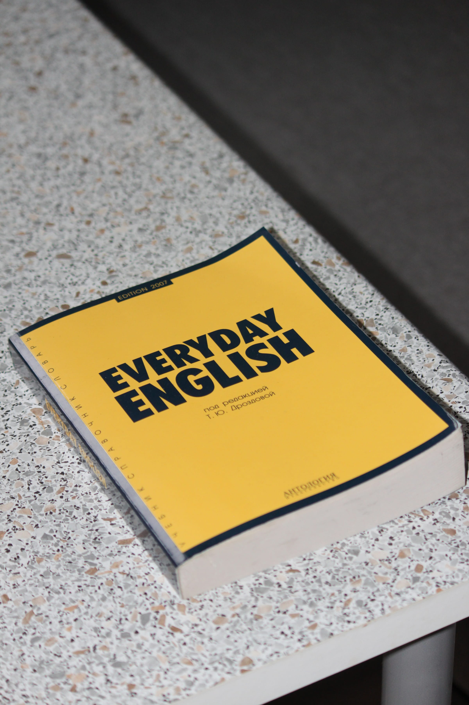

import imageAngelaFisher from '@/images/team/angela-fisher.jpg'
import BlogArticleWrapper from '../wrapper'

export const article = {
  date: '2022-12-01',
  title: 'A Short Guide to Component Naming',
  description:
    'As a developer,  the most important aspect of your job is naming components. It&apos;s not just about being descriptive and clear, but also about having fun and being creative.',
  author: {
    name: 'Angela Fisher',
    role: 'Front-end Developer',
    image: { src: imageAngelaFisher },
  },
}

export const metadata = {
  title: article.title,
  description: article.description,
}

export default function Layout({ children }) {
  return <BlogArticleWrapper article={article}>{children}</BlogArticleWrapper>
}

## 1. Brevity is Key

Time is scarce, don&apos;t waste it typing out long, descriptive component names. One approach is to give them short, cryptic names that only you will understand.

Need a button? Call it &quot;btn&quot;. A modal? How about &quot;md&quot;? You&apos;ll save precious minutes per day and you&apos;ll get the added benefit of being the only person in the codebase who knows where anything is. This is called job security.

## 2. Rank High in Search

When working in large repos with lots of collaborators, it&apos;s important that your component ranks high when people search for anything.

One way to stand out is to include all the possible search terms in your component name. Instead of &quot;SignInButton&quot; you might want call it &quot;SignInButtonAuthenticationCookieUserLogIn&quot; which will ensure that it is returned in almost any related search result.

## 3. Mix Languages

If you work remotely, it&apos;s likely you are on a global team and yet all your components have English names. This slows down your non-english colleagues considerably so you should allow them to use their native tongue when naming components.

You can create an index file that maps all the different languages within your repo. Need a dropdown? Look for &quot;Desplegable&quot;. A form? Search &quot;Форма&quot;. You&apos;ll learn multiple new languages while being more inclusive to your colleagues.

